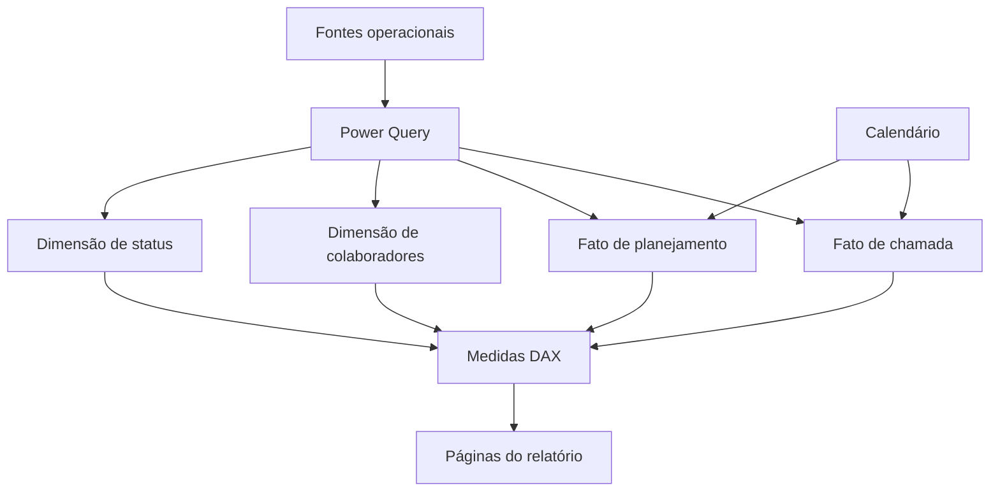

# Arquitetura da solução

## Visão simples

O relatório foi organizado em quatro responsabilidades:

1. **Origem:** registros de chamada e bases de colaboradores e planejamento.
2. **Transformação:** Power Query aplica filtros, combinações, tipagem e limpeza.
3. **Modelo:** fatos e dimensões recebem relacionamentos por chaves estáveis.
4. **Consumo:** medidas DAX alimentam páginas executivas e detalhamentos.

## Por que separar as responsabilidades?

Essa separação facilita localizar a origem de um indicador, testar uma
transformação, reaproveitar uma medida e trocar uma fonte sem redesenhar todo o
relatório.

Também reduz o risco de colocar a mesma regra em consultas, visuais e fórmulas
independentes, o que poderia gerar resultados diferentes entre páginas.

## Papel do analista de BI

O trabalho combina:

- **Dados:** garantir tipos, chaves e granularidade coerentes;
- **Negócio:** transformar perguntas de acompanhamento em regras mensuráveis;
- **Produto analítico:** apresentar indicadores com hierarquia e navegação claras.
