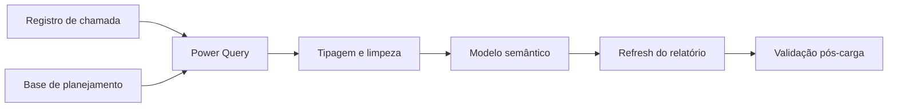
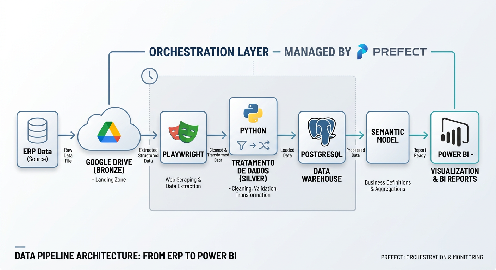
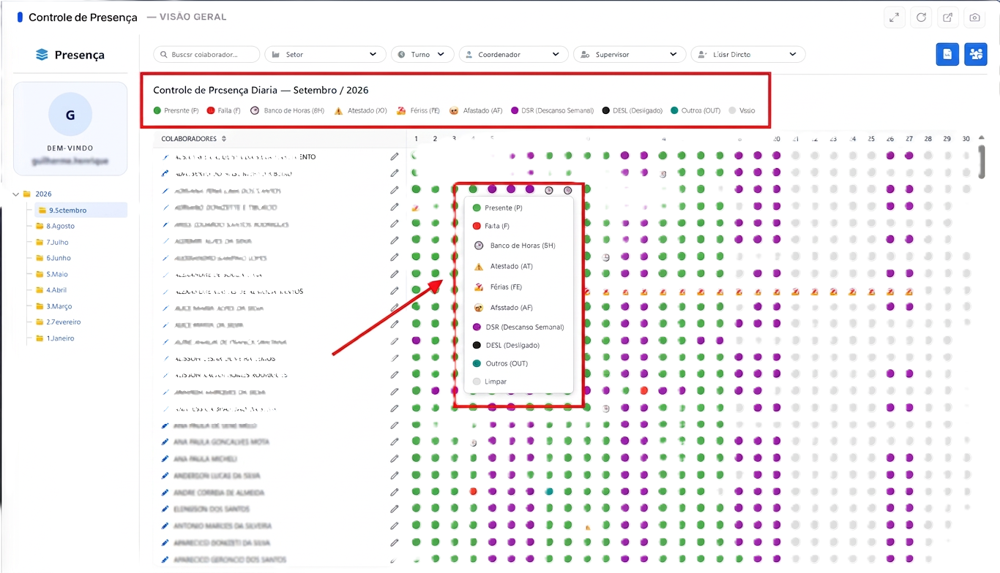

# Atualização e fontes

## Fluxo de atualização

O refresh localiza as entradas, transforma os dados, carrega as tabelas e
atualiza as medidas consumidas pelo relatório.

> Esta imagem é ilustrativa. Ela apresenta um padrão de pipeline de dados e não
> deve ser interpretada como um inventário literal das fontes deste projeto.

## Aplicativo e geração dos dados de presença

O aplicativo foi desenvolvido com **Google Apps Script** e conectado a uma
planilha do **Google Sheets**. A interface permite que os gestores da operação
realizem o input dos dados diários dos colaboradores, incluindo presença,
falta e outras ocorrências operacionais.

A planilha recebe e organiza esses lançamentos, funcionando como a fonte
operacional responsável por gerar os dados de presença e falta utilizados no
acompanhamento. Depois dessa etapa, os dados seguem para tratamento,
modelagem e consumo no Power BI.

## Fluxo operacional completo

O aplicativo recebe o input dos gestores, a planilha organiza os lançamentos e
o Power BI transforma essa base em informação para acompanhamento.

## Fontes documentadas

### Registros de chamada

A tabela de chamadas representa ocorrências individuais. Seus campos principais
incluem matrícula, status, data da ocorrência e uma referência textual de
colaboradores. A carga utiliza filtro de período e foi preparada para
atualização incremental.

### Planejamento e cadastro

As bases de apoio fornecem informações de colaborador, função, gestor, centro
de custo, data e custo de planejamento. Para a documentação pública, a origem
é descrita de forma genérica e os caminhos reais não são reproduzidos.

## Etapas de transformação

1. selecionar apenas colunas utilizadas pelo modelo;
2. remover arquivos ou registros fora do escopo;
3. padronizar nomes e tipos de data, matrícula e status;
4. ordenar e deduplicar o cadastro para preservar o registro mais recente;
5. limitar a janela de chamadas conforme os parâmetros de atualização;
6. carregar os resultados no modelo semântico.

## Validação pós-carga

| Verificação | Pergunta |
| --- | --- |
| Volume | A carga trouxe registros no período esperado? |
| Datas | As datas estão no intervalo e no tipo corretos? |
| Chaves | As matrículas possuem correspondência no cadastro? |
| Status | Os rótulos estão na dimensão e na ordem esperadas? |
| Duplicidade | O cadastro mantém uma linha por matrícula? |
| Atualização | A data apresentada representa a última carga? |

## Frequência

A frequência real depende do acordo operacional da organização. O padrão
recomendado é atualizar após a disponibilização das fontes e validar o período
carregado antes do consumo executivo.

## Ponto importante

Uma alteração de coluna, formato de data ou regra de identificação na origem
precisa ser capturada explicitamente na consulta. Caso contrário, o refresh pode
falhar ou produzir uma tabela incompleta.
