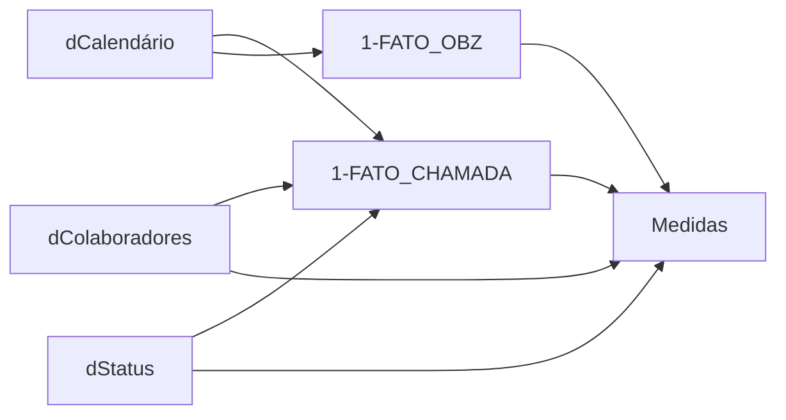

# Modelo semântico e relacionamentos

## Como ler o modelo

- **Fato** registra eventos ou valores em uma granularidade definida.
- **Dimensão** descreve os eventos e oferece filtros reutilizáveis.
- **Medida** calcula um resultado no contexto selecionado.
- **Relacionamento** conecta dimensões às tabelas que serão filtradas.

## Grupos de tabelas

| Grupo | Papel no relatório |
| --- | --- |
| Fato de chamada | Registra ocorrências, datas, matrículas e status |
| Fato de planejamento | Guarda a referência de planejamento por colaborador e data |
| Colaboradores | Descreve matrícula, função, gestor e centro de custo |
| Status | Controla rótulos e ordenação dos estados de chamada |
| Calendário | Filtra as duas tabelas de fato por data |
| Medidas | Centraliza os cálculos consumidos pelas páginas |

## Relacionamentos principais

## Chaves e direção dos filtros

As relações principais usam data, matrícula e status. O caminho preferencial é
dimensão → fato: selecionar um colaborador, status ou período reduz os eventos
correspondentes sem duplicar filtros em cada visual.

A matrícula funciona como chave de ligação entre a ocorrência e o cadastro.
Como o cadastro precisa representar a situação mais recente, a etapa de
transformação remove duplicidades mantendo o registro válido para a análise.

## Granularidade

Cada linha da fato de chamada representa uma ocorrência. A fato de planejamento
representa uma referência de planejamento em uma combinação de colaborador e
data. Manter essas granularidades explícitas evita somas duplicadas e
comparações inconsistentes.

## Boas práticas aplicadas

- usar uma dimensão calendário compartilhada;
- centralizar medidas em uma tabela própria;
- relacionar fatos por chaves tratadas;
- manter a dimensão de status com ordem explícita;
- validar correspondência de matrículas antes do consumo.
